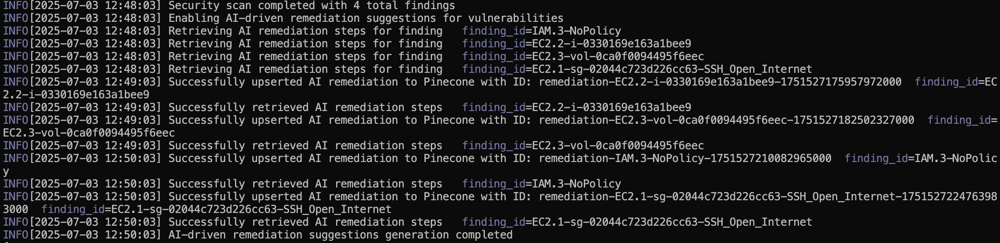
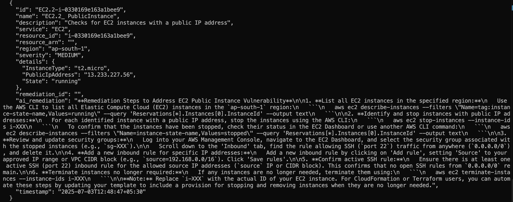

# sec-aws

A CLI tool designed to help identify common security vulnerabilites across your AWS infrastructure, specifically focusing on EC2 instances, EBS volumes, IAM users policies, and S3 bucket policies. Beyond just vulnerability detection, the project leverages LLMs and RAG to provide intelligent, context-aware remediation suggestions to secure your cloud evironment.

## Features

- Multi-Service Scanning: Scans AWS services including
    - EC2: Identifies publicly exposed instances, openSSH ports, unencrypted EBS volumes, and publicly accessible EBS snapshots
    - IAM: Detects IAM users with the `AdministratorAccess` policy, long-lived access keys, and weak password policies that are associated with an account
    - S3: Checks for publicly accessible buckets, buckets without versioning, and buckets with default encryption disabled
- AI-powered Remediation - Generates an actionable set of remediation instructions and relevant code blocks to execute for each vulnerability finding using LLMs
- RAG - Enhances LLM responsesby grounding them in a knowledge base stored in Pinecone, minimzing the scope for hallucinations and improving specificity
- Continuous Learning - Newly generated remediations are automatically upserted back into the Pinecone index, enriching the knowledge base to provide relevant context for future queries
- Output - View scan results in a table, structured JSON, or CSV
- Rate Limiting - Implements rate limiting for AWS API calls to prevent throttling

## Getting Started

- Prerequisites
    - Go
    - Pinecone (a preconfigured index)
    - Python (optional; to use the given embedding server)
- Clone the repository and install dependencies *or* download the `sec-aws` executable in the root directory
```bash
git clone https://github.com/lokeshllkumar/sec-aws.git
go mod tidy
```
- If you decide to clone the repository, build the executable using
```bash
go build -o sec-aws .
```
---
Optionally, if you'd like to use the provided embedding server
- Navigate to the `/embedding` directory
```bash
cd embedding
```
- Install the required dependencies
```bash
pip install -r requirements.txt
```
- Start the server
```bash
python main.py
```
---
- Create a Pinecone index with the name "sec-aws" and make note of the environment and the index name

## Usage

- Set the following environment variables (AWS configuration)
```bash
export AWS_ACCESS_KEY_ID=<your-aws-access-key>
export AWS_SECRET_ACCESS_KEY=<your-aws-secret-access-key>
export AWS_REGION=<aws-region-to-scan>
```
- Configure the scanner with AWS credentials and configuration details, and LLM provider details using ```configure```, which will prompt you to enter the following details
    - AWS region
    - Choice of LLM (either Ollama or the OpenAI API)
    - OpenAI API key if "openai" is chosen as the provider
    - Ollama model if the "ollama" is chosen as the provider (granite3.1-moe is the default option)
    - Pinecone API key
    - Pinecone environment
    - Pinecone index name
    - Logging level (info, warn, error, debug, fatal; info by default)
    - Embedding server URL
```bash
./sec-aws configure
```
- Run a scan with the ```scan``` to perform a vulnerability scan using the defined rules on your AWS resources
```bash
./sec-aws scan
```
- To enable remediation suggestions powered by the RAG, use the ```--ai-remediation``` flag
```bash
./sec-aws scan --ai-remediation
```
- To specify the output format (tabular, JSON, or CSV; tabular by default), use the ```--output``` flag to specify it before a scan
```bash
./sec-aws scan --output csv
```
- To enable verbose logging, use the ```-v``` flag
```bash
./sec-aws scan -v
```




## To-Do/WIP

- [ ] - support auto remediation of vulnerabilities in resources
- [ ] - extend support to other AWS services
- [ ] - construct ARN for resources using template literals